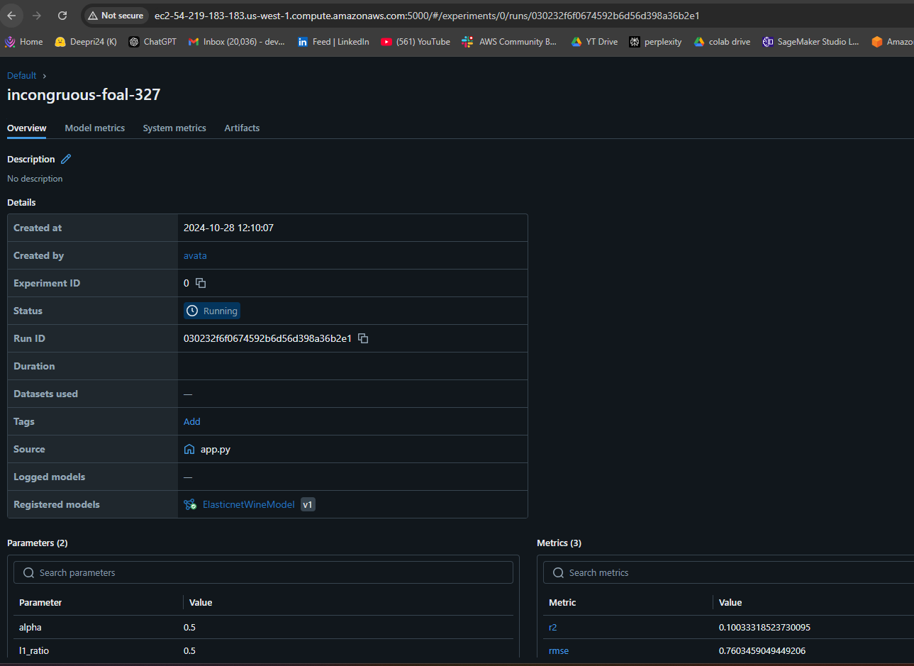
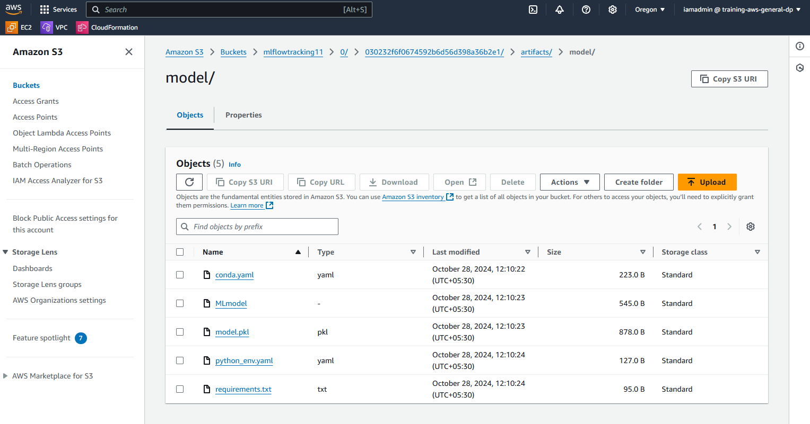

### MLFLOW On AWS
This project demonstrates the end-to-end workflow for building and logging an ElasticNet regression model with the Wine Quality dataset, using MLflow for tracking and managing the experiment. Here's a summary of each step in this script:

1. Data Loading and Preparation: The script loads a public dataset containing wine quality information from GitHub. It then splits the data into training and test sets.

2. ElasticNet Model Training: It trains an ElasticNet regression model, which is a linear model combining both Lasso (L1) and Ridge (L2) regression techniques. Parameters like alpha and l1_ratio can be set manually or passed as arguments.

3. Model Evaluation: After training, the model's performance is evaluated using metrics like:

- RMSE (Root Mean Squared Error),
- MAE (Mean Absolute Error),
- R² Score. These metrics provide insights into the accuracy of the model.

4. Experiment Tracking with MLflow: MLflow is configured to log various elements of the experiment:

- Parameters: The values of alpha and l1_ratio.
- Metrics: The RMSE, MAE, and R² scores from the evaluation.
- Model: The trained ElasticNet model, which is logged and stored either remotely or locally, depending on the tracking server setup.

5. Remote Tracking Server Configuration: The script sets up a remote MLflow tracking server hosted on AWS. This configuration allows for centralized experiment tracking, making it easier to access and compare different models and versions.

This project setup helps with logging and tracking machine learning experiments, making it easier to monitor model parameters, performance, and artifacts for reproducibility and analysis.


### MLflow on AWS Setup:

1. Login to AWS console.
2. Create IAM user with AdministratorAccess
3. Export the credentials in your AWS CLI by running "aws configure"
4. Create a s3 bucket
5. Create EC2 machine (Ubuntu) & add Security groups 5000 port

Run the following command on EC2 machine
```bash
sudo apt update

sudo apt install python3-pip

sudo apt install pipenv

sudo apt install virtualenv

mkdir mlflow

cd mlflow

pipenv install mlflow

pipenv install awscli

pipenv install boto3

pipenv shell


## Then set aws credentials
aws configure


#Finally 
mlflow server -h 0.0.0.0 --default-artifact-root s3://mlflowtracking11

#open Public IPv4 DNS to the port 5000

#set uri in your local terminal and in your code 
export MLFLOW_TRACKING_URI=http://ec2-54-219-183-183.us-west-1.compute.amazonaws.com:5000/


### Outputs 
#### Mlflow running in remote EC2 instance 


#### Model artifacts stored in S3 bucket 


